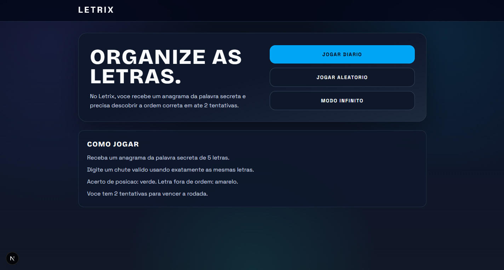
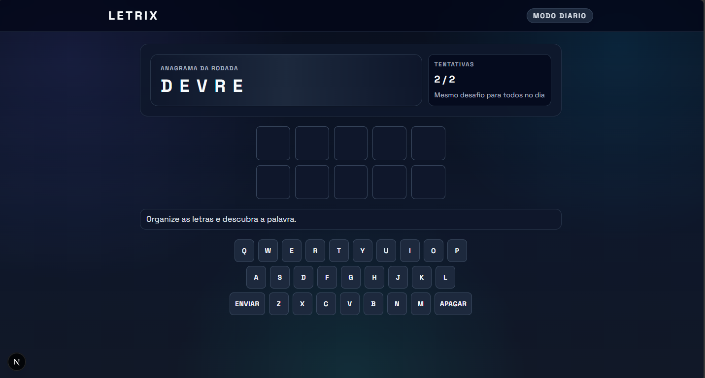

# Letrix

Jogo web de anagramas em portugues com palavras de 5 letras.

No Letrix, voce recebe as letras embaralhadas e precisa descobrir a palavra correta em ate 2 tentativas.

## Demo

### Home

### Jogo

## Funcionalidades

- Modos de jogo: diario, aleatorio, infinito e tempo.
- Validacao de chute com regras do anagrama.
- Feedback por letra (correta, presente e ausente).
- Teclado virtual + suporte ao teclado fisico.
- Interface responsiva para desktop e mobile.

## Stack

- Next.js 16
- React 19
- TypeScript
- Tailwind CSS 4

## Como rodar localmente

1. Instale as dependencias:

npm install

2. Inicie o ambiente de desenvolvimento:

npm run dev

3. Abra no navegador:

http://localhost:3000

## Scripts

- npm run dev: inicia o servidor de desenvolvimento.
- npm run build: gera o build de producao.
- npm run start: inicia a aplicacao em modo producao.
- npm run lint: executa o lint do projeto.

## Estrutura principal

- app/: rotas e paginas da aplicacao.
- src/components/: componentes de interface.
- src/lib/: regras de negocio e validacoes.
- src/data/: listas de palavras validas e respostas.

## Licenca

Projeto para fins de estudo e desenvolvimento pessoal.
